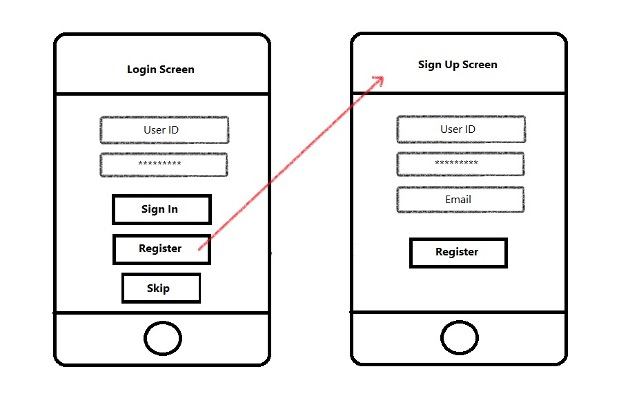

# Task Scheduler
Mobile App that serves as a motivator and reminder for its users to carry out their tasks perfectly by categorizing their tasks and granting them management functionality.

I developed this iOS app with the help of my teammate Yaqoob Husain during my Bahrain Polytechnic studies.

<iframe width="560" height="315" src="https://youtu.be/ssiNwAAJggk" frameborder="0" allowfullscreen></iframe>

[Demo Video Link](https://youtu.be/ssiNwAAJggk)

## Technology Used
- Firebase
- Adobe XD
- Swift & XCode

## Features
1. Login to application (using firebase auth)
	- Sign up
	- Sign in
	- Reset Password (by Email)
	- Sign out (by Logout button)

2. Add/Edit/Delete Tasks (Swipe to edit/delete)
	- The ability to manage tasks

3. Viewing Tasks Details
	- Once a task is clicked its details will be shown
	- Ability to change task status (completed, uncompleted)

4. Add/Edit/Delete Projects (Swipe to edit/delete)
	- The ability to manage projects

5. Viewing Projects
	- View projects details
	- View tasks within projects

6. Notifications
	- Notification user settings
	- Notifications for both tasks and projects

7. Search for Projects/Tasks
	- Able to search for tasks and projects by name
	- Edit/Delete features still do work when searching

## Low Fidelity Wireframes
- Auth Screens

- Project Management

- Task Management

- Task Details

- Task Priority

- Task Statistics

## High Fidelity Wireframes (Adobe XD)

- Auth Screens

- Project Management

- Task Management

- Search

- Notification Settings

## Developed By
- Mohamed Alalwan
- Yaqoob Husain